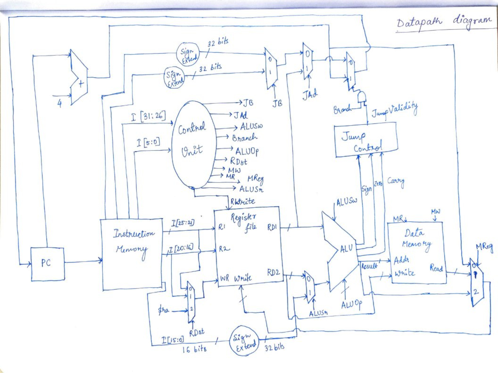
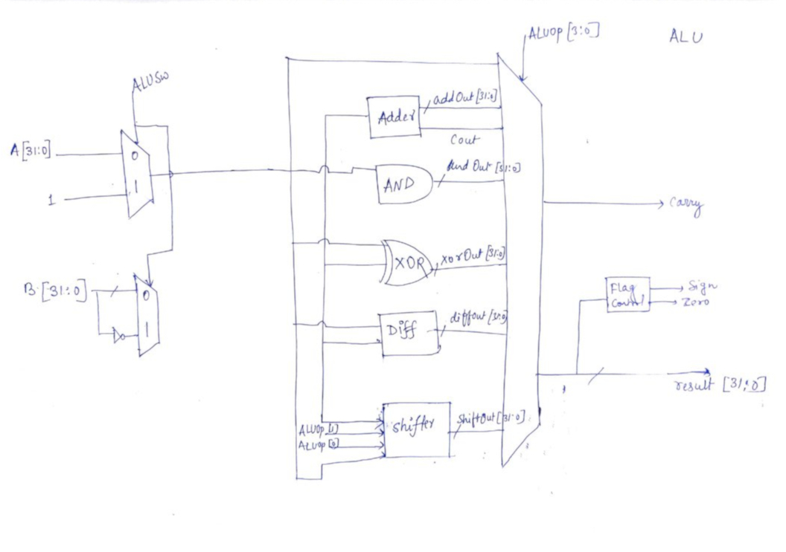

# 
 Kgp-miniRISC: A miniature RISC Processor 

> Repository for Kgp-miniRISC: A miniature RISC Processor

<!-- PROJECT LOGO -->
 

  

    <b>Kgp-miniRISC</b>
     
     
    
    
     
  

Created by: **Aritra Mitra (20CS30006)** and **Shiladitya De (20CS30061)**

 About the Project 

## Instruction Format:

**R-format:**

|opcode|rs|rt|shamt|No Use|funct|
| - | - | - | - | - | - |
|6 bits|5 bits|5 bits|5 bits|5 bits|6 bits|

Instructions with R-format:

- add
- comp
- and
- xor
- shll
- shllv
- shrl
- shrlv
- shra
- shrav
- diff

**I-format:**

|opcode|rs|No Use|Immediate value|
| - | - | - | - |
|6 bits|5 bits|5 bits|16 bit|

Instructions with I-format:

- addi
- compi

**Base Addressing-format:**

|opcode|rs|rt|Offset/Immediate|
| - | - | - | - |
|6 bits|5 bits|5 bits|16 bits|

Instructions with Base Addressing-format:

- lw
- sw

**J1-format:**

|opcode|rs|Direct address|
| - | - | - |
|6 bits|5 bits|21 bits|

Instructions with J1-format:

- br
- bltz
- bz
- bnz

**J2-format:**

|opcode|Direct  address|
| - | - |
|6 bits|26 bits|

Instructions with J2-format:

- b
- bl
- bcy
- bncy

|**Class**|**Instruction**|**Opcode**|**Function**|
| - | - | - | - |
|Arithmetic|add|000000|000000|
||comp|000000|000001|
|Logic|and|000001|000000|
||xor|000001|000001|
|Shift|shll|000010|000000|
||shrl|000010|000001|
||shllv|000010|000010|
||shrlv|000010|000011|
||shra|000010|000100|
||shrav|000010|000101|
|Memory|lw|000011|\_\_|
||sw|000100|\_\_|
|Complex|diff|000101|\_\_|
|Arithmetic immediate|addi|000110|\_\_|
||compi|000111|\_\_|
|Branch|b|001000|\_\_|
||br|001001|\_\_|
||bltz|001010|\_\_|
||bz|001011|\_\_|
||bnz|001100|\_\_|
||bl|001101|\_\_|
||bcy|001110|\_\_|
||bncy|001111|\_\_|

## Control Truth Table:

|**Instr**|**Opcode**|**Func**|**RDst**|**RWrite**|**MR**|**MW**|**MReg**|**ALUSr**|**ALUOp**|**ALUSw**|**Branch**|**JAd**|**JB**|
| - | :- | - | :- | :- | - | - | - | :- | :- | - | :- | - | - |
|add|000000|000000|00|1|0|0|00|0|0001|0|0|X|X|
|comp|000000|000001|00|1|0|0|00|0|0001|1|0|X|X|
|and|000001|000000|00|1|0|0|00|0|0010|0|0|X|X|
|xor|000001|000001|00|1|0|0|00|0|0011|0|0|X|X|
|shll|000010|000000|00|1|0|0|00|1|0100|0|0|X|X|
|shrl|000010|000001|00|1|0|0|00|1|0110|0|0|X|X|
|shllv|000010|000010|00|1|0|0|00|0|0100|0|0|X|X|
|shrlv|000010|000011|00|1|0|0|00|0|0110|0|0|X|X|
|shra|000010|000100|00|1|0|0|00|1|0111|0|0|X|X|
|shrav|000010|000101|00|1|0|0|00|0|0111|0|0|X|X|
|lw|000011|\_\_|01|1|1|0|01|1|1000|0|0|X|X|
|sw|000100|\_\_|XX|0|0|1|XX|1|1000|0|0|X|X|
|diff|000101|\_\_|XX|1|0|0|XX|0|1001|0|0|X|X|
|addi|000110|\_\_|XX|1|0|0|XX|1|0001|0|0|X|X|
|compi|000111|\_\_|XX|1|0|0|XX|1|0001|1|0|X|X|
|b|001000|\_\_|XX|0|0|0|XX|X|0000|X|1|0|0|
|br|001001|\_\_|XX|0|0|0|XX|X|0000|X|1|1|X|
|bltz|001010|\_\_|XX|0|0|0|XX|X|0000|X|1|0|1|
|bz|001011|\_\_|XX|0|0|0|XX|X|0000|X|1|0|1|
|bnz|001100|\_\_|XX|0|0|0|XX|X|0000|X|1|0|1|
|bl|001101|\_\_|10|1|0|0|10|X|0000|X|1|0|0|
|bcy|001110|\_\_|XX|0|0|0|XX|X|0000|X|1|0|0|
|bncy|001111|\_\_|XX|0|0|0|XX|X|0000|X|1|0|0|

## Description of various control signals:

**RDst:** This signal determines the register in which output is to be written.

**Rwrite:** This determines whether writing operation is to be done or not.

**MR:** This determines whether data is to be read from the memory.

**MW:** This determines whether data is to written to the memory

**MReg:** This determines what is to be written on the write register. For eg. PC + 4 is to be written on $ra.

**ALUSr:** This control signal determines what will be the second input to the ALU. For eg. Whether it is the content of the register or it is an immediate value.

**ALUOp:** ALUOp is to determine which operation needs to be done in the ALU with the inputs.

**ALUSw:** ALUSw determines whether it is a complement (2’s complement) operation or not.

**Branch:** This determines whether it is a branching operation or not.

**JAd:** This determines whether the branching address comes from a register or not. For *br* it is 1.

**JB:** This signal chooses between the two types of branchings.
## Jump Control Truth Table:

|**Instruction**|**opcode**|**Sign**|**Zero**|**Carry**|**JumpValidity**|
| - | - | - | - | - | - |
|b|001000|X|X|X|1|
|br|001001|X|X|X|1|
|bltz|001010|1|0|X|1|
|bz|001011|X|1|X|1|
|bnz|001100|X|0|X|1|
|bl|001101|X|X|X|1|
|bcy|001110|X|X|1|1|
|bncy|001111|X|X|0|1|

As evident from the above table, the *JumpValidity* = 1 for the unconditional jump cases like b, br, bl etc. but in case of conditional jumps, it is 1 only when the constraints are satisfied.

In all other cases, *JumpValidity* = 0

Fig 1: Datapath Diagram

Fig 2: ALU Diagram
